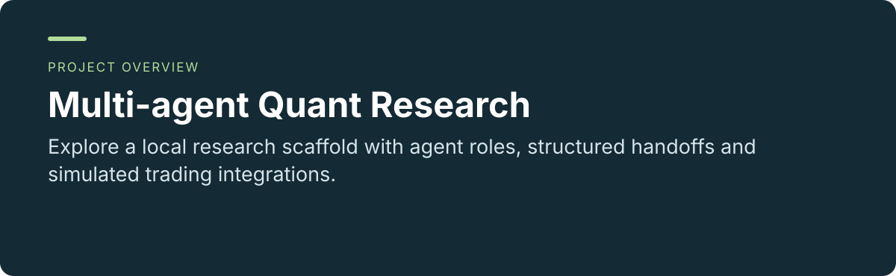
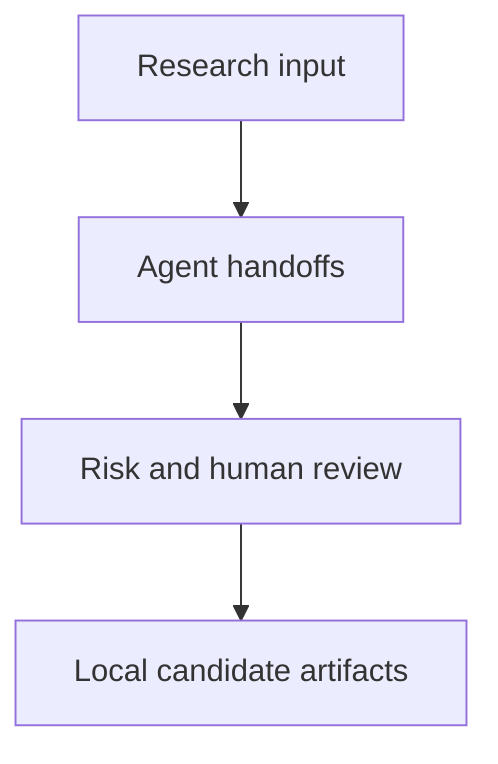

 

# Multi-agent Quant Research

**Explore a local research scaffold with agent roles, structured handoffs and simulated trading integrations.**

[Project usage and maintenance](../README.md) · [Report an issue](https://github.com/thejaytang/multi-agent-quant-trading-system/issues)

## 1. What you can do

- Follow research and strategy candidates through review and controlled promotion.
- Inspect broker and external-platform boundaries without assuming they are connected.

## 2. Start here

Use the [project commands](../README.md) and start with the documented local stub workflow. The internal package is named trading-os; this GitHub repository has a distinct name.

## 3. Use cases

These are illustrative scenarios. Only explicitly linked execution artifacts represent checks performed for this update.

| Input or request | Expected result |
|---|---|
| A research idea | A structured candidate and local review artifacts |
| A broker workflow design | Paper-mode gates and simulated responses |

## 4. Requirements and current limits

Python 3.10+ local scaffold. External integrations are stubs and do not establish real API or broker connectivity. Paper mode is the default and live trading is disabled. It does not demonstrate trading profitability. The related repositories below are scope comparisons, not a declared succession chain.

## 5. Documentation and sources

These links identify the implementation, operating instructions or related projects for a closer fit check.

- [Project guide](../README.md)
- [Risk policy](../docs/risk_policy.md)
- [Tool-oriented platform](https://github.com/thejaytang/quant-team-os)
- [Research scaffold](https://github.com/thejaytang/trading-os)
- [Related scaffold](https://github.com/thejaytang/multi-agent-quant-trading-system)
- [Manual decision support](https://github.com/thejaytang/finance-exploration)

## 6. License and maintenance

No repository-wide license is declared at the root. This presentation update does not change the terms of code, data or third-party material; confirm permission for the material you want to reuse.

This is the public introduction. Linked project documents remain authoritative for operation, constraints and maintenance. Presentation updated: 2026-09-22.
