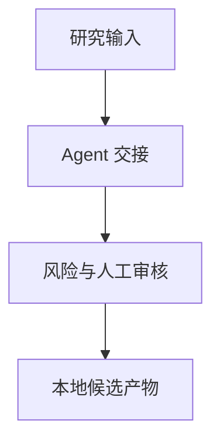

 

# Multi-agent Quant Research

**探索包含 Agent 角色、结构化交接和模拟交易集成的本地研究脚手架。**

[项目使用与维护入口](../README.md) · [报告问题](https://github.com/thejaytang/multi-agent-quant-trading-system/issues)

## 1. 能完成什么

- 跟踪研究与策略候选的审核和受控采纳过程。
- 查看券商与外部平台的接入边界，不假定它们已经接通。

## 2. 从这里开始

按[项目命令](../README.md)从已记录的本地模拟流程开始。内部程序包名为 trading-os，本 GitHub 仓库有独立名称。

## 3. 使用场景

以下为说明性场景；只有明确链接的运行产物才代表本次检查结果。

| 输入或请求 | 预期结果 |
|---|---|
| 研究想法 | 结构化候选及本地审查产物 |
| 券商工作流设计 | 模拟模式限制与模拟响应 |

## 4. 使用条件与当前边界

Python 3.10+ 本地脚手架。外部集成为占位模拟，不证明真实 API 或券商连接。默认模拟模式，实盘关闭，也不证明交易盈利能力。下列相关项目用于范围比较，不表示已经确定的继任关系。

## 5. 资料与来源

下面链接指向实现、操作说明或相关项目，便于进一步判断适用性。

- [项目指南](../README.md)
- [风险规则](../docs/risk_policy.md)
- [工具集成平台](https://github.com/thejaytang/quant-team-os)
- [研究脚手架](https://github.com/thejaytang/trading-os)
- [相关研究脚手架](https://github.com/thejaytang/multi-agent-quant-trading-system)
- [人工决策辅助](https://github.com/thejaytang/finance-exploration)

## 6. 许可与维护

仓库尚未在根目录声明统一许可证；本次展示更新没有改变代码、数据或第三方材料的许可。复用前请确认对应材料的授权。

本页为对外介绍。具体操作、约束和维护说明以链接的项目文档为准。展示页更新：2026-09-22。
